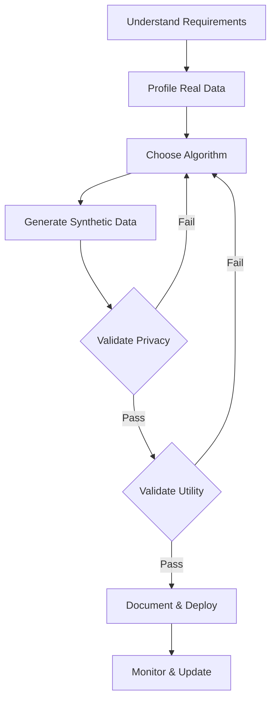

# Best Practices for Synthetic Health Data

## Overview

This guide provides industry-proven best practices for generating, validating, and using synthetic health data. Following these guidelines will help ensure your synthetic data is both useful and privacy-preserving.

## Generation Best Practices

### 1. Start Simple, Then Iterate

!!! tip "Progressive Complexity"
    Begin with basic statistical methods before moving to complex deep learning approaches. Often, simpler methods provide sufficient quality with better interpretability.

**Recommended Progression:**
1. **Gaussian Copula** - For initial exploration
2. **CTGAN** - For complex relationships
3. **Custom Models** - For specific requirements

### 2. Understand Your Data

Before generating synthetic data:

- **Profile your data**: Understand distributions, correlations, and patterns
- **Identify sensitive attributes**: Know what needs extra protection
- **Document constraints**: Clinical validity rules, business logic
- **Consider temporal aspects**: Time series, sequences, dependencies

### 3. Choose the Right Algorithm

| Use Case | Recommended Algorithm | Why |
|----------|---------------------|-----|
| Simple demographics | Gaussian Copula | Fast, preserves basic statistics |
| Complex EHR data | CTGAN | Handles mixed data types well |
| Privacy-critical | DataSynthesizer with DP | Built-in differential privacy |
| Time series | PAR or TimeGAN | Designed for sequential data |

## Privacy Best Practices

### 1. Apply Defense in Depth

Never rely on a single privacy mechanism:

```python
# Good practice: Multiple privacy layers
synthesizer = CTGANSynthesizer(
    epochs=300,
    pac=10,  # Privacy amplification
    cuda=True
)

# Add differential privacy
from sdv.single_table import DPCTGANSynthesizer
dp_synthesizer = DPCTGANSynthesizer(
    epsilon=1.0,  # Privacy budget
    epochs=300
)
```

### 2. Validate Privacy

Always check for privacy leaks:

- **Membership inference**: Can you tell if a record was in training data?
- **Attribute inference**: Can you infer sensitive attributes?
- **Re-identification risk**: Can individuals be identified?

### 3. Document Privacy Measures

Create a privacy statement documenting:
- Generation method used
- Privacy parameters (e.g., epsilon for DP)
- Validation performed
- Known limitations

## Validation Best Practices

### 1. Statistical Fidelity

Check that synthetic data maintains important properties:

```python
from sdv.evaluation.single_table import evaluate_quality

# Generate quality report
quality_report = evaluate_quality(
    real_data=real_df,
    synthetic_data=synthetic_df,
    metadata=metadata
)

# Should be > 0.7 for good quality
print(f"Overall Quality Score: {quality_report.get_score()}")
```

### 2. Clinical Validity

For healthcare data, ensure clinical plausibility:

- **Value ranges**: Check all values are clinically possible
- **Relationships**: Verify medical relationships are preserved
- **Temporal patterns**: Ensure disease progressions make sense
- **Rare events**: Confirm important edge cases are represented

### 3. Utility Testing

Test synthetic data for your intended use:

```python
# Train models on both real and synthetic
real_model = train_model(real_data)
synthetic_model = train_model(synthetic_data)

# Compare performance
real_score = evaluate_model(real_model, test_data)
synthetic_score = evaluate_model(synthetic_model, test_data)

utility_ratio = synthetic_score / real_score
print(f"Utility preservation: {utility_ratio:.2%}")
```

## Implementation Best Practices

### 1. Data Preprocessing

Prepare your data properly:

```python
# Handle missing values
data = data.fillna(method='appropriate_to_context')

# Normalize/standardize if needed
from sklearn.preprocessing import StandardScaler
scaler = StandardScaler()
numerical_columns = data.select_dtypes(include=[np.number]).columns
data[numerical_columns] = scaler.fit_transform(data[numerical_columns])

# Document transformations for reversibility
```

### 2. Metadata Management

Always create comprehensive metadata:

```python
from sdv.metadata import SingleTableMetadata

metadata = SingleTableMetadata()
metadata.detect_from_dataframe(data)

# Customize as needed
metadata.update_column(
    column_name='diagnosis_code',
    sdtype='categorical'
)

# Add constraints
metadata.add_constraint(
    constraint_type='positive',
    column_name='age'
)
```

### 3. Version Control

Track your synthetic data generation:

- **Version your code**: Including generation scripts
- **Track parameters**: All hyperparameters used
- **Log experiments**: What worked and what didn't
- **Tag releases**: For reproducibility

## Common Pitfalls to Avoid

### 1. Over-fitting to Training Data

!!! warning "Avoid Memorization"
    If your synthetic data is too similar to real data, it may leak privacy. Use techniques like early stopping and regularization.

### 2. Ignoring Rare Events

Synthetic data often under-represents rare but important events:

```python
# Bad: Losing rare diseases
synthetic = synthesizer.sample(1000)

# Good: Ensure representation
conditions = {
    'rare_disease': True
}
conditional_synthetic = synthesizer.sample_conditions(
    conditions=conditions,
    num_rows=100
)
```

### 3. Inadequate Validation

!!! danger "Never Skip Validation"
    Always validate both privacy and utility. Synthetic doesn't automatically mean private!

### 4. Poor Documentation

Document everything:
- Why synthetic data was needed
- How it was generated
- What validation was performed
- Known limitations
- Appropriate uses

## Deployment Best Practices

### 1. Access Control

Even synthetic data should be protected:
- Implement appropriate access controls
- Log usage for audit trails
- Consider data use agreements

### 2. Clear Labeling

Always clearly label synthetic data:

```python
# Add clear markers
synthetic_df['is_synthetic'] = True
synthetic_df.attrs['generation_date'] = datetime.now()
synthetic_df.attrs['generation_method'] = 'CTGAN v1.0'
```

### 3. Regular Updates

Synthetic data should be refreshed:
- As real data distributions change
- When new privacy threats emerge
- To incorporate new use cases

## Regulatory Compliance

### Key Considerations

1. **HIPAA** (US Healthcare)
   - Ensure de-identification standards are met
   - Document expert determination if used
   - Maintain audit trails

2. **GDPR** (European Union)
   - Verify data is truly anonymous
   - Document lawful basis for processing
   - Consider data minimization

3. **Local Regulations**
   - Check jurisdiction-specific requirements
   - Consult legal experts when needed

## Recommended Workflow



## Checklist for Production

Before deploying synthetic data:

- [ ] Privacy validation completed
- [ ] Utility testing passed
- [ ] Clinical validity confirmed (if applicable)
- [ ] Documentation complete
- [ ] Access controls implemented
- [ ] Legal review completed
- [ ] Monitoring plan in place
- [ ] Update schedule defined

## Resources for Deep Dives

- [Privacy Metrics](../technical/evaluation-metrics.md)
- [Algorithm Selection Guide](../technical/algorithms/index.md)
- [Regulatory Compliance](../regulatory/index.md)
- [Community Best Practices](../community/index.md)

---

Remember: Synthetic data is a powerful tool, but it requires careful implementation. When in doubt, consult with privacy experts and validate thoroughly.